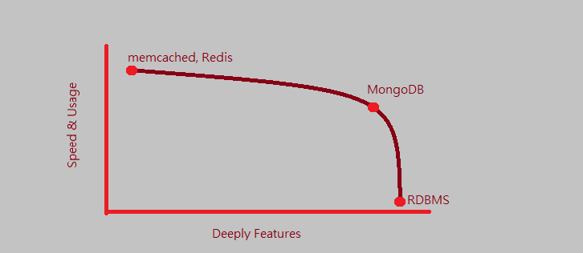
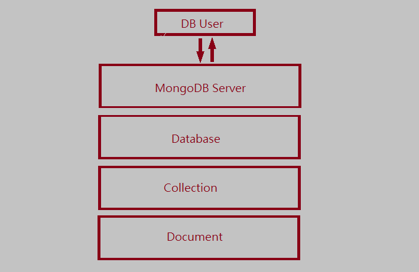

# NoSQL 数据库 <br> MongoDB  <br> I

2014-07, @MyTesting


...
## 我是谁? Who am I?

### 网秦广告平台 QA, 花名 @\_漏斗

-------------------

GitHub: @[Ralph-Wang](https://github.com/Ralph-Wang)

Blog : <http://ralph-wang.github.io>

Weibo: @\_漏斗

> 嘁, 打个酱油
...

## 大纲 Syllibus

### 1. 关系型数据库与 NoSQL

* 什么是数据库
* 关系型数据库
* NoSQL 数据库

### 2. MongoDB 基础

* 为什么独爱 MongoDB
* MongoDB 基本使用

#### 3. 在 Python 中使用 MongoDB (Part II)

* 在 Python 中使用 MongoDB
* 一个简单的项目(带单元测试)

.....

## 什么是数据库? WTF Database

* 我们需要一个`工具`来保存和管理一些`资源`
* 这个工具就叫`数据库`
* 被管理的资源称之为`数据`


.......

## 关系型数据库 RDBMS

* 它是`数据库`
* 用 `SQL` 来管理数据

```
insert into tbl (id, name) values (1, 'string');
select * from tbl where id = 1;
update tbl set id = id + 10 where id = 1;
delete from tbl where id = 11;
```


.........

## 种类繁多的关系型数据库 A Bunch Of RDBMS

* Oracle

* MySQL

* SQLite


............

## 什么是 NoSQL? WTF NoSQL Database
### 它还是数据库
### 不过, 它不用 SQL 来管理数据


.............

## 眼花缭乱的 NoSQL A Bunch Of NoSQL
* memcached


* Redis


* MongoDB


...............

## 为什么独爱 MongoDB Why MongoDB?
* 优秀的查询性能
* 强大的查询功能




............

## 预备知识 Knowledge Requirements

* JavaScript Basic

```
var name = "Ralph-Wang";
var age = 25;
if (1 === 2) {
	age = 20;
}
var sum = 0;
for (var i=0; i < 10; i++) {
	sum += i;
}
```

* JSON (JavaScript Object Notaion)

```
{
	"key" : "value",
	"num" : 1024,
	"list" : [1, 2, 3]
}
```

..................

## 安装 Install

### 1. [下载](http://www.mongodb.org/downloads)

* 根据你的系统版本选择

### 2. 解压

```
$tar zxvf mongodb-<os-version>-<reversion>.tgz
```

### 3. 运行

```
$mongod --dbpath /where/you/put/the/data
```


...................

## [Mongo 命令行 Mongo Shell](http://try.mongodb.org/)

* JavaScript 解释器


..............

## 存储结构 Struct
* 库结构
* 数据形式 [BSON](http://bsonspec.org/) (Binary JSON)


..................

## 增删改查 CRUD

* 添加数据 insert

```
db.collection.insert(document)
```

* 查询数据 find

```
db.collection.findOne(query);
db.collection.find(query);
```

* 更新数据 update (tricks)

```
db.collection.update(query, document)
```

* 删除数据 remove

```
db.collection.remove(query)
```

.......

## 查询进阶 Advanced Find

* [正则](http://deerchao.net/tutorials/regex/regex-1.htm)查询 regex find

```
db.collection.find({name : /Ra.*ph/});
```

* 查询操作符 operator

```
db.collection.find({age : { $gt : 22}});
db.collection.find({age : { $lt : 30}});
db.collection.find({$and [{age : {$gt : 22}}, {age : {$lt : 30}}]};
db.collection.find({$or : [{age : {$gt : 30}}, {age : {$lt : 22}}]});
```

* 排序/跳过/限量 sort/skip/limit

```
db.collection.find().sort({age : 1});
db.collection.find().skip(2);
db.collection.find().limit(1);
db.collection.find().sort({age : 1}).skip(2).limit(1);
```

..............

## 更新进阶 Advanced Update

* 更新操作符 operator

```
db.collection.update({}, {$inc : {age : 1}});
db.collection.update({}, {$mul : {age : 2}});
db.collection.update({}, {$set : {name : 2}});
```

* 更新选项 multi/upsert

```
db.collection.update({}, {$set : {name : 2}, {multi : true}});
db.collection.update({}, {$set : {name : 2}, {upsert : true}});
db.collection.update({}, {$set : {name : 2}, {multi : true, upsert : true}});
```

...


# 怎么应用到各类语言?!!!

.....

# .insert({`'Thanks'` : `'Next'`})
